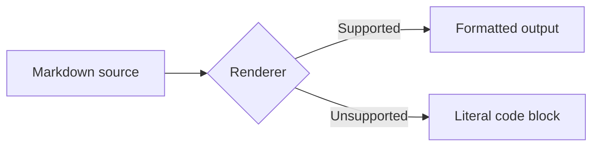
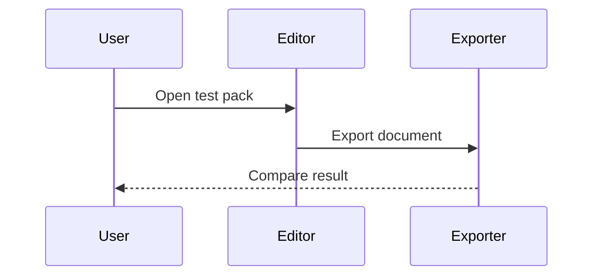
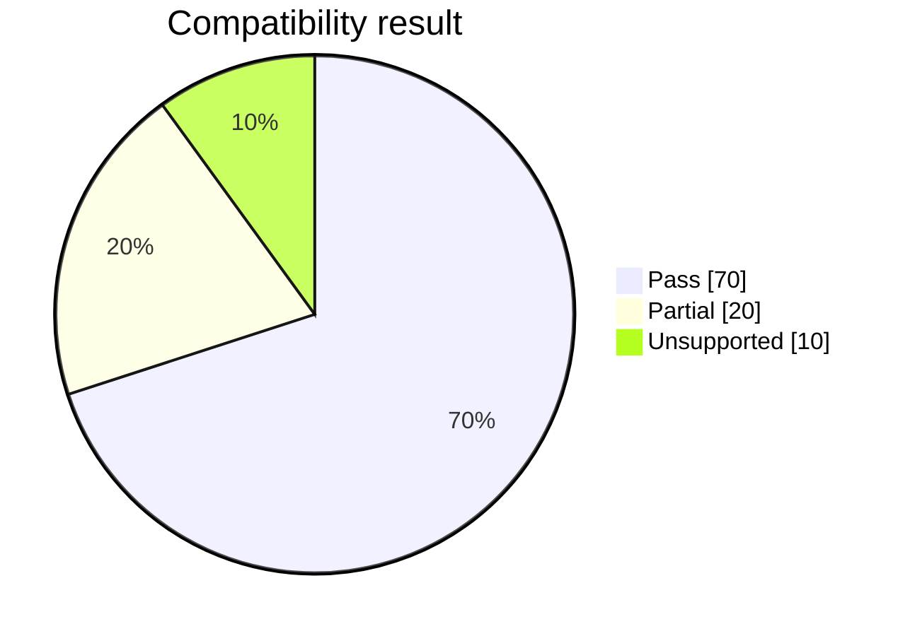
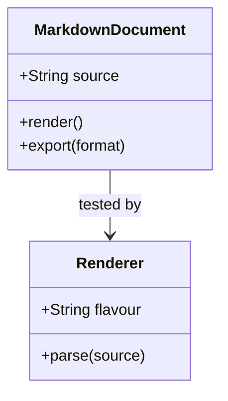
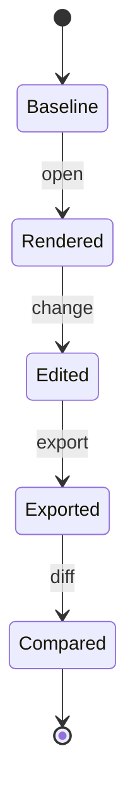
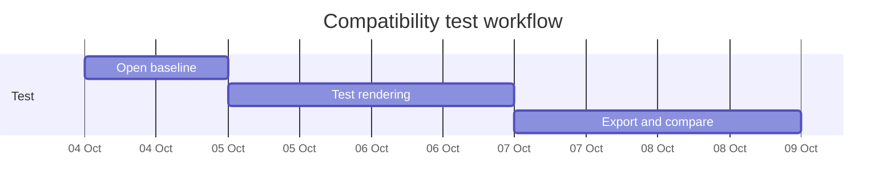
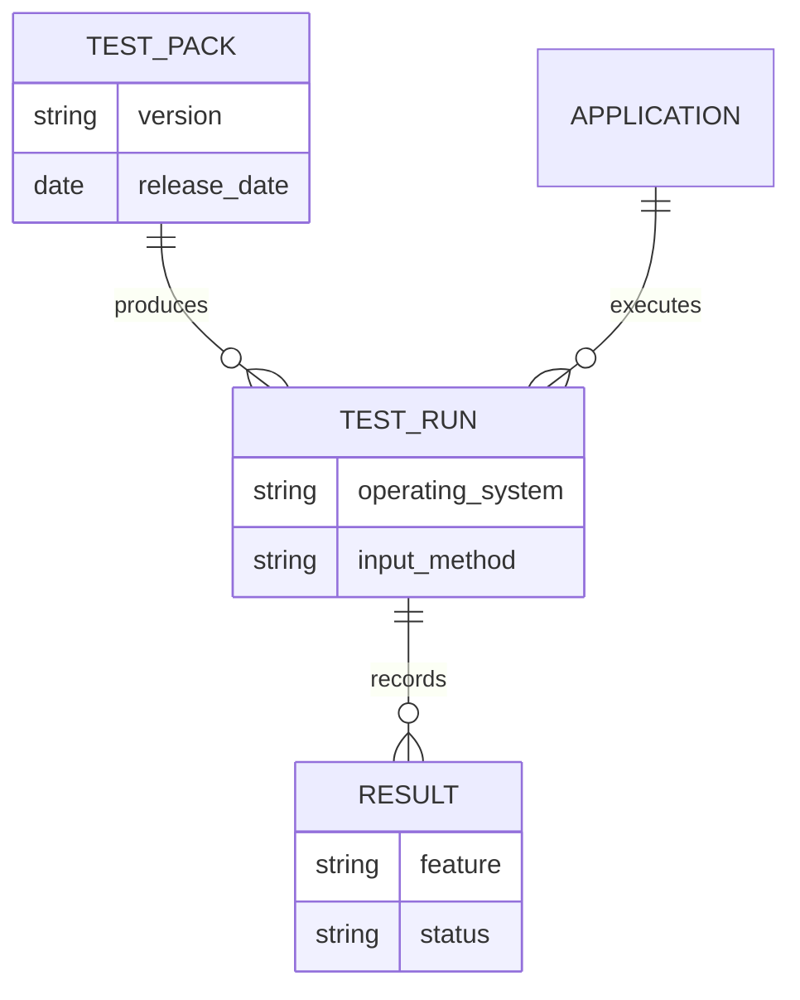

# Markdific Markdown compatibility test pack

Use this file to compare how an application parses, displays, edits, exports, and reimports Markdown.

Keep the accompanying `assets` folder beside this file. The bundle contains PNG, JPEG, WebP, filename-with-spaces, HTML-image, and Obsidian pasted-image fixtures used in section 6. Every bundled fixture uses the same simple master artwork so the test changes the file format or path case without introducing unrelated visual differences. The parent-relative and root-relative examples are deliberately unresolved outside a larger project or website.

> [!IMPORTANT]
> No single result is expected for every section. Each test is labelled **CommonMark**, **GFM**, **extension**, **Obsidian**, **HTML**, or **round trip**. Record unsupported syntax as unsupported rather than treating every difference as a defect.

## Test record

| Field | Result |
| --- | --- |
| Application | [Name] |
| Version | [Version] |
| Operating system | [OS and version] |
| Test date | YYYY-MM-DD |
| Input method | Open file / paste / import |
| View tested | Source / split / preview / reading |
| Export formats | HTML / PDF / DOCX / Markdown / other |
| Markdown mode | CommonMark / GFM / application-specific / unknown |
| Tester | [Name] |

## Result scale

- **Pass:** meaning and structure are preserved.
- **Partial:** content remains usable, but formatting or metadata changes.
- **Unsupported:** an optional feature is not implemented, but its source remains visible or recoverable. Missing content belongs under Fail, not Unsupported.
- **Fail:** content disappears, becomes misleading, or cannot be recovered.
- **Not tested:** the test could not be completed.

## 1. Headings — CommonMark

# Heading level 1

## Heading level 2

### Heading level 3

#### Heading level 4

##### Heading level 5

###### Heading level 6

Setext heading level 1
======================

Setext heading level 2
----------------------

### Heading with *emphasis*, `code`, and [a link](https://example.com)

#### Heading with punctuation: colon, slash /, ampersand & and question mark?

Check:

- All six ATX heading levels and both Setext heading levels remain distinct.
- The document outline preserves the source heading order and levels.
- Generated heading IDs or anchors, if the application provides them, remain stable after export and reimport.
- Inline formatting in headings is handled consistently.

## 2. Paragraphs and line breaks — CommonMark

This is one source line.
This is the next source line with a soft line break. A conforming renderer may display both source lines as one paragraph separated by a space or line ending.

This line ends with two spaces.  
This line should begin after a hard line break.

This line ends with a backslash.\
This line should also begin after a hard line break.

This paragraph is separated from the next paragraph by a blank line.

This is a new paragraph.

Check whether trailing spaces survive source editing and Markdown-to-Markdown round trips.

## 3. Emphasis and literal punctuation — CommonMark

*Italic with asterisks*  
_Italic with underscores_  
**Bold with asterisks**  
__Bold with underscores__  
***Bold and italic with asterisks***  
___Bold and italic with underscores___  
Nested **bold with *italic* inside**  
Nested *italic with **bold** inside*  
Literal escaped characters: \* \_ \# \[ \] \( \) \` \\  
Intraword underscore: customer_id  
Intraword asterisk test: micro*service  
Empty-looking delimiters: **** and ____

## 4. Strikethrough, highlight, subscript, and superscript — extensions

~~Two-tilde GFM strikethrough~~  
~Single-tilde GFM strikethrough~  
==Common highlight extension==  
H~2~O as a common subscript extension  
x^2^ as a common superscript extension

Expected: strikethrough is defined by GFM. Highlight, subscript, and superscript vary by application.

## 5. Links and autolinks — CommonMark and GFM

[Inline link](https://example.com "Example title")  
[Relative link](../guides/example.md)  
[Root-relative link](/docs/markdown/)  
[Reference link][reference-example]  
[Collapsed reference][]  
<https://example.com/path?query=markdown&mode=test>  
<person@example.com>  
GFM bare URL: https://example.com/bare-url  
GFM bare email: person@example.com  
Escaped destination: [parentheses](https://example.com/a\(b\))

[reference-example]: https://example.com/reference "Reference title"
[collapsed reference]: https://example.com/collapsed

## 6. Images — CommonMark, application behaviour, and portability

Remote web image:


Relative local image:


Relative image with spaces:


Relative JPEG image:


Relative WebP image:


Parent-relative image:


Root-relative web image:


Obsidian pasted-image embed:

![[assets/Pasted image 20261004143000.png]]

HTML image with explicit dimensions:


Check:

- Whether remote images load.
- How the application resolves relative paths.
- Whether spaces are encoded, preserved, or broken.
- Whether PNG, JPEG, and WebP files render consistently.
- Whether imported images are copied, linked, embedded, or discarded.
- Whether alt text and titles survive export.
- Whether dimensions survive conversion.

## 7. Unordered, ordered, and nested lists — CommonMark

- First bullet
- Second bullet
  - Nested bullet
    - Third-level bullet
  - Nested item with continuation text.

    This paragraph belongs to the nested item.
- Final bullet

1. First ordered item
2. Second ordered item
   1. Nested ordered item
   2. Another nested item
3. Third ordered item

5. Ordered list starting at five
6. Next item

- Mixed nesting
  1. Ordered inside unordered
  2. Second ordered child
     - Unordered grandchild

Check tight versus loose list spacing, continuation paragraphs, numbering, and indentation after round trips.

## 8. Task lists — GFM

- [x] Completed item
- [X] Completed item with uppercase X
- [ ] Incomplete item
  - [x] Completed nested item
  - [ ] Incomplete nested item
- [ ] Item containing **bold**, [a link](https://example.com), and `code`

Check whether boxes are interactive, exported as real controls, or preserved as literal text.

## 9. Blockquotes and nesting — CommonMark

> A single-paragraph blockquote.

> A blockquote with two paragraphs.
>
> The second paragraph remains inside the quote.

> Nested quotation level one
>
> > Nested quotation level two
> >
> > - List inside a nested quote
> > - Second item

> ### Heading inside a blockquote
>
> ```text
> Code fence inside a blockquote
> ```

## 10. Inline code and fenced code blocks — CommonMark

Inline code: `npm run test`  
Code containing a backtick: ``Use `code` inside a longer code span.``  
Code with leading and trailing spaces: `` code ``

```javascript
const message = "Markdown fence test";
console.log(message);
```

~~~python
def greet(name: str) -> str:
    return f"Hello, {name}"
~~~

````markdown
```json
{"nested": "A three-backtick fence shown inside a four-backtick fence"}
```
````

```text
Characters that must remain literal here:
# not a heading
* not emphasis
[not a link](https://example.com)
<b>not interpreted HTML</b>
```

Check syntax highlighting, language labels, copying, wrapping, tabs, and nested fences.

## 11. Indented code — CommonMark

The following block is indented by four spaces:

    first line
    second line
        nested indentation

Check whether import/export converts it to a fenced block or retains the indentation.

## 12. Tables — GFM

| Left aligned | Centred | Right aligned | Formatting |
| :--- | :---: | ---: | --- |
| Alpha | 12 | 1,234.50 | **Bold** |
| Beta | 3 | -42.00 | `code` |
| Gamma | 0 | 0.00 | [Link](https://example.com) |

Escaped pipe inside a table:

| Expression | Expected cell content |
| --- | --- |
| `A \| B` | A vertical bar between A and B |
| `` `x\|y` `` | A pipe inside inline code; GFM requires the pipe to be escaped |

Unescaped pipe inside a code span, shown literally as a parsing stress case:

```markdown
| Expression |
| --- |
| `x|y` |
```

Under GFM, the unescaped pipe can act as a cell separator even though it appears inside a code span.

Known stress cases:

| Case | Value |
| --- | --- |
| Empty cell | |
| Unicode | café, naïve, 東京, مرحبًا, 👩🏽‍💻 |
| Long unbroken value | https://example.com/a/very/long/path/that/tests/wrapping/behaviour |
| Line break request | first line<br>second line |

Check alignment, escaped pipes, empty cells, inline HTML, wrapping, and DOCX/PDF export.

## 13. Thematic breaks — CommonMark

Three hyphens:

---

Three asterisks:

***

Three underscores:

___

Check that a hyphen line beneath text is not accidentally converted into a Setext heading.

## 14. Escapes, entities, and Unicode — CommonMark

Escaped list marker: 1\. This should not start a list.  
Escaped heading: \# This should not become a heading.  
Named entity: &copy;  
Numeric entity: &#169;  
Literal ampersand: research & development  
Emoji: ✅ ⚠️ 📄  
Composed and decomposed accents may look identical: café / café  
Bidirectional text sample: English — العربية — עברית  
CJK sample: Markdown 測試 マークダウン 테스트

Check search, copying, normalization, and PDF font coverage.

## 15. Raw HTML — CommonMark permits blocks; renderers may sanitize

<details>
<summary>Expandable details test</summary>

This content is inside a native HTML details element.

</details>

<kbd>Ctrl</kbd> + <kbd>S</kbd>

<mark>HTML mark element</mark>

<table>
  <tr><th>HTML</th><th>Table</th></tr>
  <tr><td>One</td><td>Two</td></tr>
</table>

<script>console.log("A secure renderer should not execute this script.")</script>

Expected: secure applications should sanitize or disable unsafe HTML. Record sanitization as a security behaviour, not automatically as a failure.

## 16. Footnotes — extension

This statement has a footnote.[^standard-note]

This statement has a longer footnote.[^long-note]

Repeated reference to the first note.[^standard-note]

[^standard-note]: A short footnote definition.

[^long-note]: A longer footnote can contain multiple lines.

    It may also contain a second paragraph when indented correctly.

## 17. Definition lists — extension

CommonMark
: A defined specification for Markdown parsing.

Renderer
: Software that converts Markdown into a display or another format.

Round trip
: Exporting and reimporting content to measure what survives.

## 18. Mathematics — extension

Inline dollar math: $E = mc^2$

Display dollar math:

$$
\int_{0}^{1} x^2\,dx = \frac{1}{3}
$$

Inline parenthesis math: \(a^2 + b^2 = c^2\)

Display bracket math:

\[
\mathbf{A}\mathbf{x} = \mathbf{b}
\]

Multiline aligned expression:

$$
\begin{aligned}
f(x) &= x^2 + 2x + 1 \\
     &= (x + 1)^2
\end{aligned}
$$

Matrix expression:

$$
\begin{bmatrix}
1 & 2 \\
3 & 4
\end{bmatrix}
\begin{bmatrix}
x \\
y
\end{bmatrix}
=
\begin{bmatrix}
5 \\
6
\end{bmatrix}
$$

Piecewise expression:

$$
f(x) =
\begin{cases}
x^2, & x \ge 0 \\
-x, & x < 0
\end{cases}
$$

Summation, product, and limits:

$$
\sum_{i=1}^{n} i = \frac{n(n+1)}{2}, \qquad
\prod_{k=1}^{n} k = n!, \qquad
\lim_{x \to 0} \frac{\sin x}{x} = 1
$$

GitHub-style inline math containing Markdown-sensitive characters:

$`\sqrt{3x-1}+(1+x)^2`$

GitHub-style fenced math block:

```math
\left( \sum_{k=1}^{n} a_k b_k \right)^2
\le
\left( \sum_{k=1}^{n} a_k^2 \right)
\left( \sum_{k=1}^{n} b_k^2 \right)
```

Currency-versus-math stress case: The price is $5, the discounted price is $4, and the equation is $y = 5x + 4$.

Check delimiter support, escaping, matrices, multiline alignment, equation numbering, accessibility text, and export method. Math is not part of the formal CommonMark or GFM specifications. GitHub and other products support it as an additional feature, and their accepted delimiters can differ.

## 19. Mermaid diagrams — extension















Expected: unsupported renderers should normally show a fenced code block rather than delete the source. This section covers flowchart, sequence, pie, class, state, Gantt, and entity-relationship diagrams. Mermaid is not part of CommonMark or GFM, and individual Mermaid versions may support different syntax.

## 20. Obsidian wiki-links — Obsidian

[[Project Alpha]]  
[[Project Alpha|Custom link text]]  
[[Project Alpha#Milestones]]  
[[Project Alpha#^block-id]]  
![[Embedded Note]]  
![[diagram.png]]  
![[document.pdf#page=2]]

Expected outside Obsidian: these may remain literal text.

## 21. Obsidian callouts — Obsidian

> [!NOTE]
> This is a note callout.

> [!WARNING] Custom callout title
> This warning has a custom title.

> [!TIP]- Folded by default
> This callout requests a collapsed state.

> [!QUESTION]+
> This callout requests an expanded state.

Expected outside Obsidian: most renderers show ordinary blockquotes containing the callout marker.

## 22. Obsidian tags, properties, comments, and block IDs — Obsidian

Inline tags: #project/alpha #status-review  
Escaped non-tag: \#not-a-tag  
Block reference target. ^compatibility-block

%%This is an Obsidian comment and may remain visible elsewhere.%%

Properties were included in the YAML front matter at the start of this file. Check whether arrays, quotation marks, dates, and unknown keys survive.

## 23. Link reference placement and duplicates — difficult parsing

[Forward reference][placed-later]

[Duplicate reference][duplicate]

[placed-later]: https://example.com/later
[duplicate]: https://example.com/first
[duplicate]: https://example.com/second

CommonMark specifies that the first matching reference definition takes precedence, so `[Duplicate reference][duplicate]` should point to `/first`. Record whether the application follows that rule and whether export rewrites references as inline links.

## 24. HTML comments and visible comments — CommonMark/HTML

Visible sentence before the comment.

<!-- This HTML comment should not appear in rendered output. -->

Visible sentence after the comment.

Check whether comments survive source round trips and whether they are included in exported HTML, DOCX, or PDF.

## 25. Long lines, wrapping, and whitespace

This is a deliberately long paragraph designed to test visual wrapping, horizontal scrolling, source wrapping, reflow during Markdown-to-Markdown export, and whether an editor inserts hard line breaks when it wraps text on screen. The sentence should remain one logical paragraph even if it occupies many display lines.

Text followed by trailing spaces should be inspected in source mode.   


The preceding area contains blank-line stress. Check whether repeated blank lines are collapsed.

## 26. File names and destinations

[Space in file name](Project%20Plan.md)  
[Unicode file name](résumé.md)  
[Fragment](#result-scale)  
[Query and fragment](https://example.com/page?q=markdown#result)  
[Parent path](../README.md)  
[Dot-relative path](./notes.md)

Check whether links are rewritten when the document or target is renamed.

## 27. Round-trip formatting cases

Complete these tests separately. Do not overwrite the original test pack.

### Markdown → Markdown

1. Open or import this file.
2. Make one harmless edit.
3. Save or export as Markdown.
4. Compare the source files.

Inspect:

- front matter preservation;
- heading style changes;
- bullet-marker and ordered-list changes;
- whitespace and line endings;
- reference links converted to inline links;
- fence characters and lengths;
- image path rewriting;
- HTML sanitization;
- unsupported extensions removed or escaped.

### Markdown → rich text → Markdown

1. Import this file into a rich-text editor.
2. Export or copy the result back as Markdown.
3. Compare meaning and structure, not only exact characters.

Likely loss points include comments, front matter, footnote identifiers, custom attributes, Mermaid source, math delimiters, wiki-links, callout types, and exact whitespace.

### Markdown → DOCX/PDF/HTML

Check:

- Word heading styles and navigation;
- editable versus flattened tables;
- working hyperlinks;
- image embedding and resolution;
- code wrapping and monospace styling;
- diagram and math rendering;
- page breaks and orphaned headings;
- selectable text in PDF;
- alt text and accessibility structure;
- sanitization of raw HTML.

## 28. Intentionally ambiguous source shown literally

The following source is inside a four-backtick fence so it cannot break the test document:

````text
paragraph
---

- item
  ---
  continuation or thematic break?

***ambiguous emphasis***

[unclosed link](https://example.com

```unclosed-fence
The fence is intentionally not closed inside this literal sample.
````

Record whether the application offers diagnostics, silently changes the source, or preserves it.

## 29. Compatibility results

| Area | Pass | Partial | Unsupported | Fail | Not tested | Notes |
| --- | :---: | :---: | :---: | :---: | :---: | --- |
| CommonMark headings and paragraphs | [ ] | [ ] | [ ] | [ ] | [ ] | |
| Emphasis and escapes | [ ] | [ ] | [ ] | [ ] | [ ] | |
| Links and images | [ ] | [ ] | [ ] | [ ] | [ ] | |
| Lists and blockquotes | [ ] | [ ] | [ ] | [ ] | [ ] | |
| Code spans and blocks | [ ] | [ ] | [ ] | [ ] | [ ] | |
| GFM tables | [ ] | [ ] | [ ] | [ ] | [ ] | |
| GFM task lists | [ ] | [ ] | [ ] | [ ] | [ ] | |
| GFM strikethrough and autolinks | [ ] | [ ] | [ ] | [ ] | [ ] | |
| Raw HTML and sanitization | [ ] | [ ] | [ ] | [ ] | [ ] | |
| Footnotes | [ ] | [ ] | [ ] | [ ] | [ ] | |
| Math | [ ] | [ ] | [ ] | [ ] | [ ] | |
| Mermaid flowchart and sequence | [ ] | [ ] | [ ] | [ ] | [ ] | |
| Mermaid pie, class, and state | [ ] | [ ] | [ ] | [ ] | [ ] | |
| Mermaid Gantt and ER diagrams | [ ] | [ ] | [ ] | [ ] | [ ] | |
| Obsidian wiki-links and embeds | [ ] | [ ] | [ ] | [ ] | [ ] | |
| Obsidian callouts and metadata | [ ] | [ ] | [ ] | [ ] | [ ] | |
| Markdown round trip | [ ] | [ ] | [ ] | [ ] | [ ] | |
| DOCX export | [ ] | [ ] | [ ] | [ ] | [ ] | |
| PDF export | [ ] | [ ] | [ ] | [ ] | [ ] | |
| HTML export | [ ] | [ ] | [ ] | [ ] | [ ] | |

## 30. Summary

- **Strongest support:** [Features]
- **Partial support:** [Features]
- **Unsupported but safely preserved:** [Features]
- **Content-loss risks:** [Features]
- **Best use case:** [Use case]
- **Not recommended for:** [Use case]
- **Round-trip verdict:** Lossless / Structurally equivalent / Lossy

## Reference standards

- CommonMark 0.31.2: <https://spec.commonmark.org/0.31.2/>
- GitHub Flavored Markdown: <https://github.github.com/gfm/>
- Mermaid documentation: <https://mermaid.js.org/>
- GitHub mathematical expressions: <https://docs.github.com/en/get-started/writing-on-github/working-with-advanced-formatting/writing-mathematical-expressions>
- Obsidian links: <https://help.obsidian.md/links>
- Obsidian callouts: <https://help.obsidian.md/callouts>

Attribution: Markdific Markdown Compatibility Test Pack v1.0, licensed under CC BY 4.0. When publishing results, link to the versioned file and repository so readers can reproduce the test.
